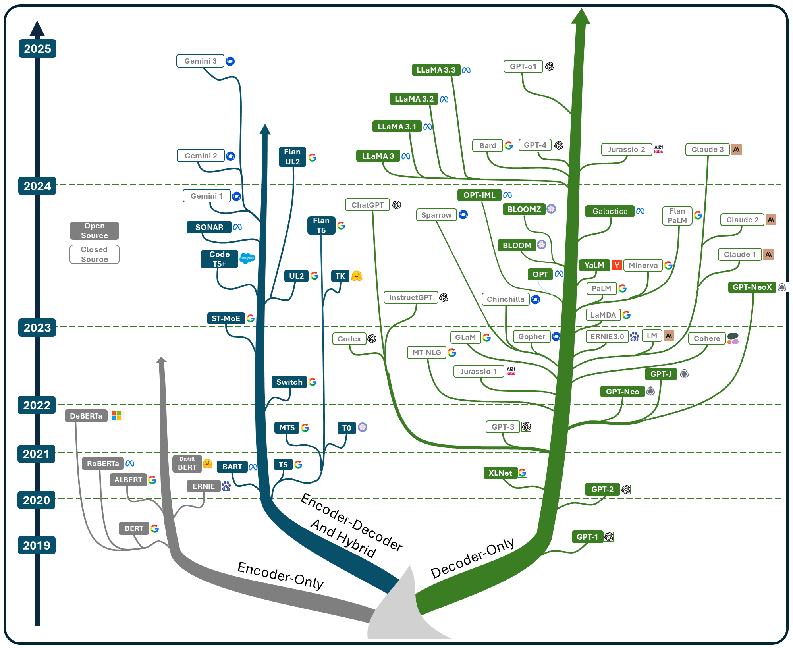

<div align="center">
  <h1>🗣 Let's Think Out Loud: Large Language Model Exploration</h1>
</div>

---

[](https://github.com/astorfi/LLM-Alignment-Project-Template/issues)
[](https://opensource.org/licenses/MIT)
[](https://github.com/astorfi/LLM-Alignment-Project-Template/actions)
[](https://www.python.org/)
[](https://pytorch.org/)
[](https://github.com)

---

## 📂 Table of Contents

- [Overview](#-overview)
- [Installation](#-installation)
- [Auto-Regressive](#-auto-regressive)
- [Features](#-features)
- [Project Structure](#-project-structure)

- [Deployment](#-deployment)
  - [Kubernetes Deployment](#kubernetes-deployment)
  - [Canary Deployment](#canary-deployment)
  - [Monitoring and Logging](#monitoring-and-logging)
- [Training and Evaluation](#-training-and-evaluation)
- [Testing](#-testing)
- [Future Work](#-future-work)
- [Contributing](#-contributing)
- [License](#-license)
- [Contact](#-contact)

## 🚀 Overview

In this exploration, we aim to delve deeply into the details and concepts within the realm of Large Language Models (LLMs). This journey is not about having all the answers upfront but about thinking out loud, openly sharing ideas, revisiting thoughts, and refining our understanding as we progress. Mistakes and course corrections are not just expected but embraced as part of the process.

This repository is a collaborative space where every comment, suggestion, or insight is valuable and can lead to meaningful discoveries. Together, let’s embark on this exciting adventure into the world of LLMs and uncover their incredible potential.

Let’s get started.

---
<p align="center">
  
</p>

---

## 📦 Installation

1. **Install Dependencies**:
   ```bash
   !pip install transformers
   !pip install accelerate
   !pip install datasets

   ```
---
## 🌟 Auto-Regressive
For more details on auto-regressive methods, refer to the [auto-regressive.md](./auto-regressive.md) file.
