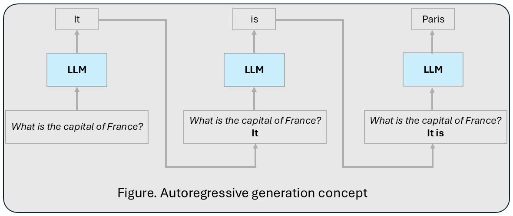

## 📌 What We Are Talking About?

Imagine trying to guess what someone will say next. That’s what an autoregressive model does—one word at a time, like filling in the blanks of a story. This is how does "autoregressive" work.

LLMs leverage the **autoregressive method**, where the next token in a sequence is predicted based on all previously generated tokens. This approach enables LLMs to generate text step-by-step, with each token conditioned on the context of prior tokens, allowing coherent and contextually relevant outputs. Actually, the words come from:

   💥  <strong>Auto:</strong> "Self" – It refers to the fact that the model relies on its own previous outputs (or previous values in a sequence) to make predictions.  
   💥  <strong>Regressive:</strong> "Based on dependencies" – Each prediction depends on the values that came before it in the sequence.

 

> *Example: The LLM wants to answer this question "What is the capital of France?"*
> 

> 
> 

> The above figure illustrates the autoregressive process step by step:  

>  1. **Step 1**: The input prompt *"What is the capital of France?"* is fed into the LLM, which predicts the first token: **"It"**.  
> >    - Context so far: *"What is the capital of France? It"*.  

>  2. **Step 2**: The model takes the updated context and predicts the next token: **"is"**.  
> >    - Updated context: *"What is the capital of France? It is"*.  

>  3. **Step 3**: With the expanded context, the model generates the next token: **"Paris"**.  
> >    - Final context: *"What is the capital of France? It is Paris"*.

   💥  <strong>Token-by-Token:</strong> Predictions are made one word at a time.  
   💥  <strong>Context Matters:</strong> Each prediction uses the original prompt + previous outputs as input.

